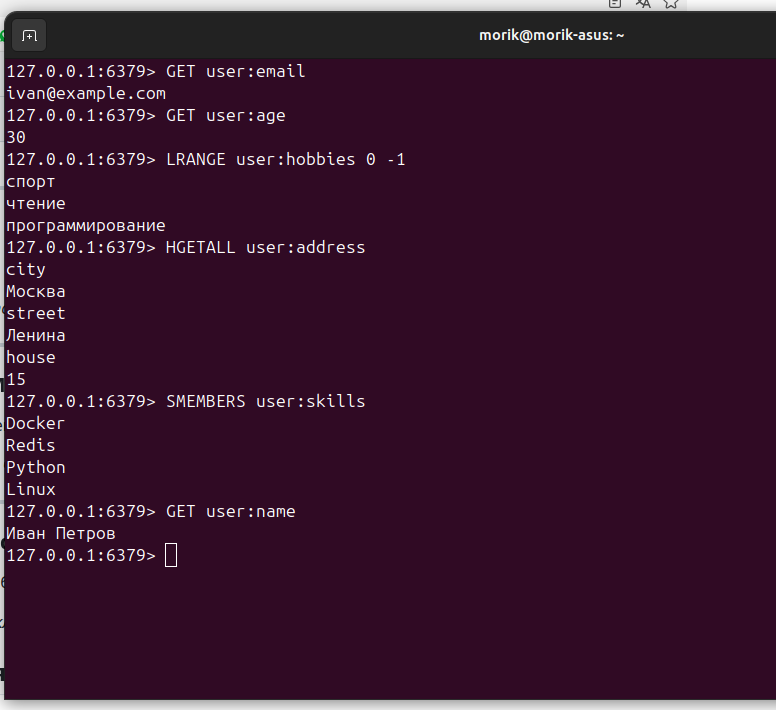

# Домашнее задание к занятию «Кеширование Redis/memcached» - Фастовец Александр Александрович

### Задание 1. Кеширование 

Приведите примеры проблем, которые может решить кеширование. 

---
Может решить
-Низкая скорость отклика
-Высокая нагрузка на источник
-Избыточный сетевой трафик
---

### Задание 2. Memcached

Установите и запустите memcached.

---

---

### Задание 3. Удаление по TTL в Memcached

Запишите в memcached несколько ключей с любыми именами и значениями, для которых выставлен TTL 5. 

---

---

### Задание 4. Запись данных в Redis

Запишите в Redis несколько ключей с любыми именами и значениями. 

*Через redis-cli достаньте все записанные ключи и значения из базы, приведите скриншот этой операции.

